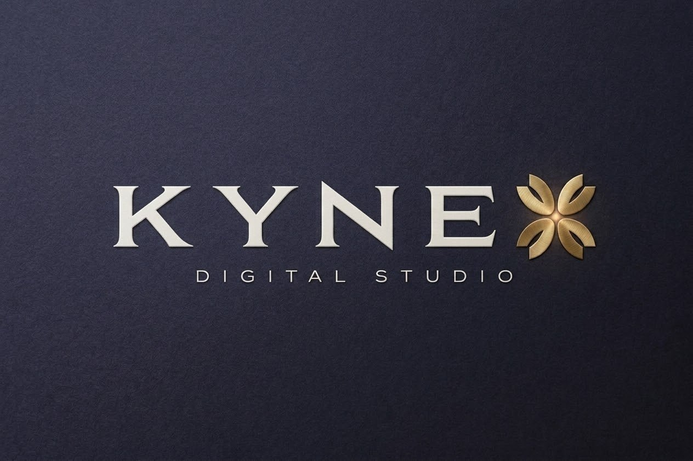

  <!-- صورة الغلاف الرئيسية -->
  

 

  <!-- أزرار التواصل الاجتماعي -->
   
  
  

<h2>🌐 Discover KYNEX Digital Studio</h2>

  <a href="https://kynex-studio-gwha.vercel.app/" target="_blank" rel="noreferrer nofollow">
      <!-- اللوغو كزر تفاعلي يوجه نحو الموقع -->
      
  </a>
   
  <strong><a href="https://kynex-studio-gwha.vercel.app/">Visit Our Official Platform ➡️</a></strong>

<h2>🚀 What We Do</h2>
<ul>
  <li><strong>Visual Identity & Branding:</strong> Crafting premium digital presences.</li>
  <li><strong>Web Platform Development:</strong> Building fast, scalable, and responsive platforms.</li>
  <li><strong>Workflow Automation:</strong> Integrating webhooks, data pipelines, and notifications.</li>
  <li><strong>Lead Generation Systems:</strong> Architecting high-converting digital funnels.</li>
</ul>

<h2>🛠️ Our Tech Stack & Tools</h2>

  
  
  
  
  
  

<h2>📊 GitHub Stats</h2>

  

